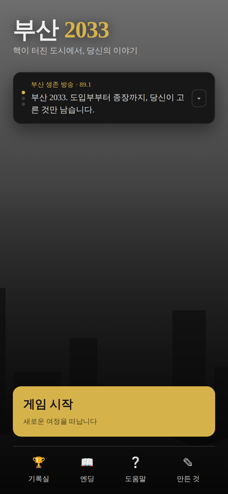
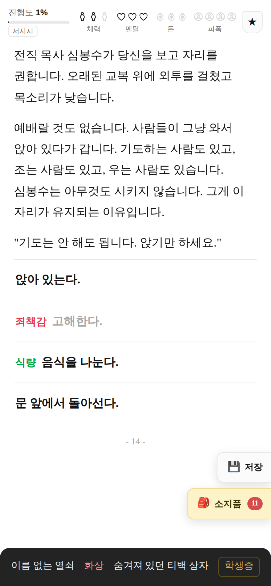
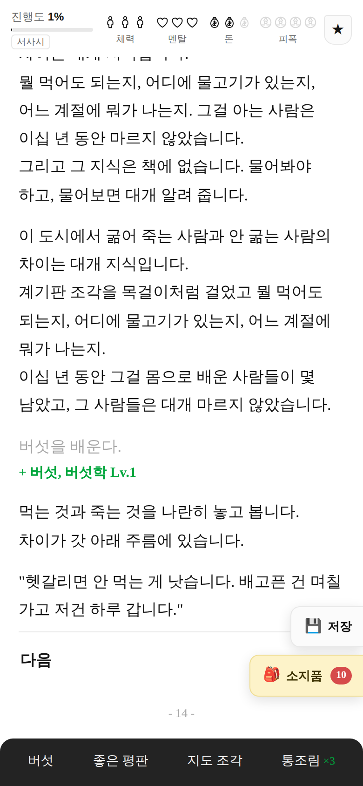
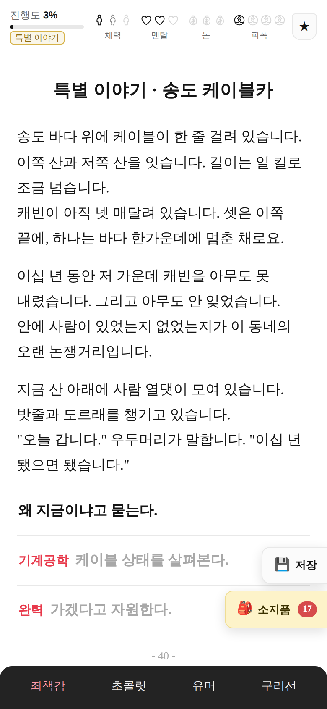
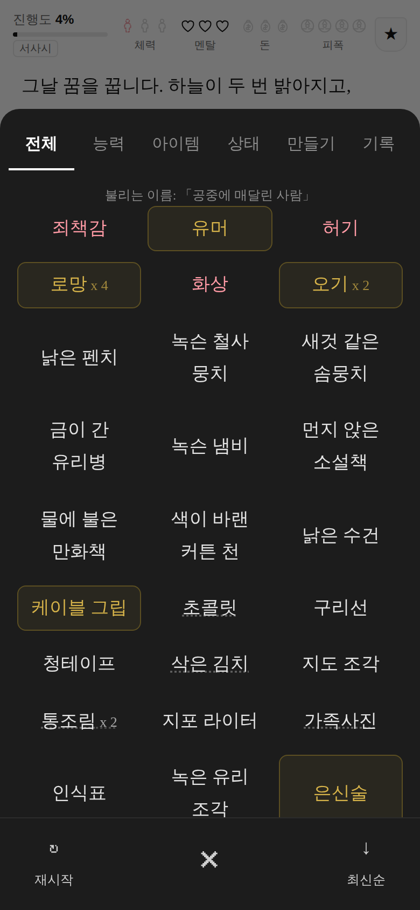
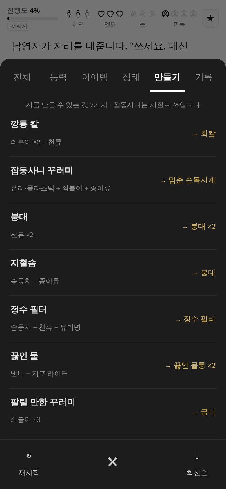
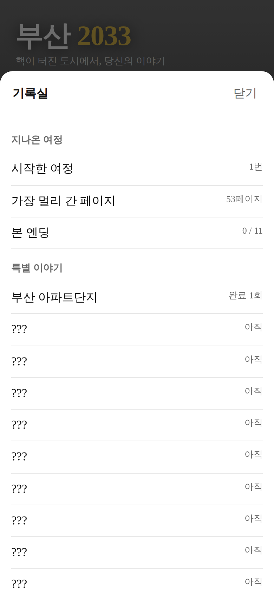

# 부산 2033

핵이 터진 부산을 배경으로 한 **텍스트 서사 선택지 게임**.
페이지를 넘기며 읽고, 선택하고, 1,200페이지 끝에서 엔딩을 본다.
가는 길에 손으로 쓴 **특별 이야기 110편**이 판마다 다른 순서로 끼어들고,
거기서 얻은 **칭호**가 한참 뒤에 되돌아온다.
미션으로 모은 **쿠키**로 상점에서 **장편 이야기 9편**(장면 20~30개짜리)을 사서 여정에 얹을 수 있다.

브라우저에서 바로 돌아가고, 그대로 **안드로이드 APK** 로도 빌드된다.

| 메인 메뉴 | 장면 | 선택 뒤 | 특별 이야기 |
|---|---|---|---|
|  |  |  |  |

| 가젯 | 만들기 | 기록실 |
|---|---|---|
|  |  |  |

```
web/     게임 본체 (HTML + CSS + 순수 JS, 외부 의존성 0)
android/ WebView 셸과 APK 빌드 스크립트
tools/   APK 조립·서명 도구와 자동 플레이 검증기
```

## 바로 해 보기

```bash
# 브라우저
xdg-open web/index.html      # 또는 그냥 파일을 브라우저로 열기

# 데이터 정합성 검사 (없는 능력/아이템 참조, 조사 처리 누락)
node tools/validate.mjs

# 끝까지 자동 플레이 + 중복 검사
node tools/simulate.mjs 3

# APK 빌드 (Android Studio / SDK 불필요)
bash tools/fetch-android-tools.sh
bash android/build.sh
# -> build/busan2033.apk
```

## 읽는 방식

한 화면이 장면 하나입니다. 짧은 문단이 한 줄씩 넘어가는 대신, **여러 문단이 한 화면에** 들어갑니다.
선택을 하면 화면이 바뀌지 않고, 고른 선택지가 회색으로 남고 그 아래에 얻은 것이 초록색으로,
그리고 결과 문단이 이어 붙습니다. 다 읽고 "다음"을 누르면 페이지가 하나 넘어갑니다.

한 판은 **1,200페이지**이고, 본문은 약 **36만 자**입니다. (짧은 페이지 5,000장보다 읽는 분량이 많습니다.)

## 게임 방식

원작 격인 <서울 2033>(반지하게임즈) 의 진행 방식을 부산 배경으로 옮겨 왔다.

| 요소 | 내용 |
|---|---|
| 사연 | 게임을 시작하면 **맨 처음 장면에서** 고른다. **애프터에이틴** / **코마** / **언어치브드 메리지** / **온에어** / **세이버** 다섯. 도입부와 본편이 통째로 달라진다 |
| 자원 | 체력 · 멘탈 · 돈 각 **3칸**, 부산 특화로 **피폭 4칸** 추가 |
| 가젯 | 능력 **55종**과 아이템 **3,635종**을 하나로 취급 |
| 선택지 | 필요한 가젯이 앞에 붙는다. 가지고 있으면 **초록**, 없으면 **빨강**(선택 불가) |
| 감정 | 로망·유머·두통·우울함도 소지품처럼 들고 다니고 서로 변환된다 (로망 → 진통제 ×3) |
| 진행 | 장면 단위. 끼니(28p)와 잠자리(61p)가 주기적으로 돌아온다 |
| 부상 | 상처·골절·화상·열·허기는 소지품처럼 붙어 계속 체력을 갉는다. 붕대와 의약품은 소지품 창에서 바로 쓴다 |
| 잡동사니 | 2,600종이 넘는 물건. 재료로 쓰이거나, 수집가에게 팔리거나, 그중 15종은 나중에 판을 뒤집는다 |
| 만들기 | 소지품 창에서 40가지 조합. 재질만 맞으면 어떤 잡동사니든 재료가 된다 |
| 쓰는 법 | 소지품 창에서 바로 못 쓴다. **쓸 자리가 이야기 안에서 온다.** 붕대가 필요한 자리에 오면 선택지 앞에 「붕대」가 초록으로 붙는다 |
| 소리 | 고를 때마다 짧게 딸깍. 파일이 아니라 그때그때 만들어 내는 소리라 용량이 안 늘어난다 (도움말에서 끄고 켠다) |
| 특별 이야기 | 손으로 쓴 단편·중편 **110편**. 순서와 페이지를 판마다 새로 섞고, 한 여정에 같은 편은 두 번 안 나온다 |
| 상태 | 감기·감염·출혈·중독·저주·벌레 공포증… 몸에 붙어 체력과 멘탈을 갉는다. 진료소·목욕탕·모닥불에서 떨어지고, 몇 가지는 평생 안 떨어진다 |
| 이름 | 「부산항의 영웅」 「엽우회」 「표낭도」 「이모의 친구」 … 세력과 동네가 붙여 주는 이름 17종 |
| 칭호 | 「단골」 「산 사람」 「열아홉 번째 사람」 … 칭호가 있어야만 열리는 사건이 7종 따로 있다 |
| 사망 | 다치면 한 칸이 통째로 날아간다. **세 번 맞으면 끝**. 다만 **의약품 · 주사기 · 나노머신 · 생명의 부적**이 있으면 그 자리에서 한 번 되살아난다 |
| 총 | 73자루. **맞는 탄이 있어야 총이다.** 5.56 / 7.62 / 9밀리 / .45 / 12게이지 / .300 / 5.7 / 석궁 볼트 / 새총 구슬 |
| 던지는 것 | 수류탄 · 연막탄 · 화염병 · 섬광탄, 그리고 아주 드물게 **백린탄**(던진 사람도 다친다) |
| 정착 | 1,100페이지가 넘으면 마을이 빈집 열쇠를 내밉니다. **여기서 그만 걷겠다**고 하면 그 자리에서 끝납니다 |
| 종장 | 진행도 100%(1,200페이지)에 닿으면 종장이 열리고, 그동안 쌓은 단서와 특별 이야기 편수에 따라 엔딩이 갈린다 |

### 세 번 맞으면 끝난다

**다치면 한 칸이 통째로 날아간다.** 체력도 멘탈도 세 칸이니, 세 번 맞으면 그 자리에서 끝난다.
짐을 지거나 밤새 걷는 것 같은 "힘든 일"은 그 절반만 깎는다. 총 맞는 것과 무거운 걸 드는 것은 다르기 때문이다.
굶는 것과 노숙하는 것은 눈금만 깎는다. 그건 사고가 아니라 계속되는 상태이기 때문이다.
그리고 **도입부에서는 죽지 않는다.** 아직 여정이 시작되기 전이라서다.
회복 한 점은 **딱 한 칸 분량의 피해만** 되돌린다.

예전에는 회복이 쌓인 마모를 통째로 0 으로 지웠다. 그래서 로망을 하나 들고 다니면
멘탈이 영원히 세 칸이었고, 끼니 한 번이 그동안 맞은 것을 전부 없던 일로 만들었다.
지금은 칸과 마모를 하나의 "누적 피해"로 계산해서 그런 공짜 회복이 없다.
HUD 에서 마지막으로 켜진 칸이 마모만큼 흐려지므로, 다음 한 대에 꺼진다는 것이 눈에 보인다.

### 죽기 직전에 가방을 뒤진다

체력이나 멘탈이 0 이 되는 순간 되살릴 물건을 찾는다. 있으면 쓰고 그 자리에서 일어선다.

| 물건 | 어디서 | 돌아오는 양 |
|---|---|---|
| 의약품 | 어디서나 | 한 칸 |
| 의료용 주사기 | 떠돌이 진료소·총포상에서 얻거나 산다 | 두 칸 |
| 나노머신 · 응급 의료키트 · 제세동기 | 컨테이너·지하 시술실 | 두 칸 |
| 생명의 부적 | 무당에게 **한 여정에 딱 하나** | 세 칸 + 상처·골절·화상·열·허기·우울함까지 |

값이 싼 것부터 쓰고, 쓴 물건은 사라진다. 되살릴 것이 하나도 없으면
「사망했습니다」가 뜨고 재시작만 남는다.

## 사건의 결

사건은 네 가지 결로 섞여 나온다. 한 판에서 네 종류가 전부 나오는 것을 자동 검증으로 확인한다.

- **긴장** (12종) — 추격, 매복, 저격, 붕괴 탈출, 가스 누출, 인질, 십자포화, 익사 구조, 정전, 배신, 지뢰밭. 문장을 짧게 끊고, 선택은 언제나 뭔가를 잃는 쪽으로 간다.
- **유머** (10종) — 전기밥솥을 모시는 사람들, 갈매기와의 자존심 싸움, 종말 이후에도 영업하는 다단계, 아파트 반상회, 아직 돌아가는 노래방 기계, 개들의 조직, 통조림 소믈리에, 사투리 통역 시비.
- **보상** (15종) — 아래 "잡동사니" 참고.
- **칭호** (7종) — 특별 이야기에서 얻은 이름을 가진 사람에게만 열린다. 아래 "칭호" 참고.
- **배움** (8종) — 능력 55종을 실제로 가르쳐 주는 자리. 학당, 전파상, 골목, 체육관, 산, 무대, 조합 사무실, 그리고 오징어심리학자.
- **몸** (8종) — 감기와 감염이 붙는 자리, 진료소·목욕탕·모닥불에서 떨어지는 자리, 이름이 붙는 자리.
- **총** (4종) — 총포상, 총싸움, 사격 연습, 땅에 묻힌 탄약함.
- **한 번뿐** (2종) — 무당(생명의 부적)과 떠돌이 진료소(의료용 주사기). 부적 쪽은 한 여정에 한 번만 나온다.

## 로망은 약이다

원작 <서울 2033>에서 로망이 그랬듯, 이 게임에서도 **로망은 마약류**입니다.
이십 년 전 좋았던 기억을 아주 선명하게 되돌려 준다는 것, 그래서 한 알에 집 한 채 값이라는 것,
세 번 먹으면 그 값을 계속 치르게 된다는 것.

- **아주 희귀합니다.** 이야기 사백 군데에서 나오던 것을 스무 곳으로 줄였습니다.
  그 자리를 대신 **안도 · 온기 · 안정됨**이 채웁니다. 흔한 위로는 흔한 이름으로 부릅니다.
- 파는 사람이 지하에 있고, **로망 중독자**가 골목에 앉아 있습니다.
  먹을 것을 주거나, 재워 주거나, 진료소로 데려가거나, 지나가거나 — 넷 다 이 도시에서 흔한 선택입니다.
- 만드는 자리를 찾으면 그 안에서 항생제와 진통제가 녹아 로망이 되고 있는 것을 보게 됩니다.

## 능력은 배우기도 하고 익기도 한다

일부러 배우는 자리(학당·전파상·골목·체육관·산·무대·조합)는 그대로 있고,
여기에 더해 **쓰다 보면 저절로 늡니다.** 능력이 필요한 선택지를 고르면
성공하든 실패하든 조금씩 오르고, 처음 쓰는 능력일수록 빨리 붙습니다.

능력 레벨은 판정에 그대로 반영됩니다. Lv.0 으로 dc 1 판정을 하면 세 번에 한 번쯤 되고,
Lv.3 이면 웬만한 판정은 넘어갑니다.

## 짐승과 거처

- **개와 고양이는 길들일 수 있습니다.** 개껌·목줄·동물용 완구·먹을 것, 고양이에게는 개박하.
  아무것도 없으면 **그냥 앉아서 기다리는 것**도 방법입니다. 야생의 친구가 있으면 그게 제일 잘 통합니다.
- **다친 짐승**은 응급처치·의약품·메스로 고쳐 주면 따라옵니다.
- 데리고 다니면 밤에 잘 자고, 먹을 것이 두 배로 들고, 묻힌 것을 찾아 줍니다.
- **아지트**를 발견하면 거처가 됩니다. 짐을 덜어 놓고, 푹 자고, 밥을 지어 먹고,
  벽에 뭔가를 걸어 **꾸밀 수 있습니다.** 꽃 한 다발, 하늘색 페인트 한 통, 태엽 시계 하나.

## 새로 늘어난 일상

이번에 사건 열둘을 더 넣었습니다. 전부 사람이 사람에게 하는 일입니다.

- **언덕 위 진료소** — 이 도시 진료소는 대개 높은 데 있습니다. 아픈 사람을 데려가는 일이 곧 언덕을 오르는 일입니다. 업고 오르거나, 들것을 만들거나, 줄 순서를 다시 세웁니다.
- **편지 비둘기** — 사람 발로 사흘, 비둘기로 반나절. 대신 새는 자기 집으로만 갑니다. 그래서 이 도시의 편지 길은 언제나 한쪽으로만 뚫려 있습니다.
- **마을 재판** — 오늘 안건은 닭 한 마리입니다. 서른 명이 보고 있고, 판결에 강제력은 없는데 서른 명이 봤다는 것이 강제력입니다.
- **하수도** — 지상으로 세 시간, 지하로 한 시간. 대신 비가 오면 이 길은 한 시간 만에 강이 됩니다.
- **사진관** — 필름이 열두 장 남았습니다. 한 장을 쓰면 열한 장이 됩니다. 그래서 아무 때나 안 찍습니다.
- **물탱크** — 스무 집이 여기서 물을 받습니다. 안을 씻는 일은 아무도 하고 싶어 하지 않아서 한 사람이 이십 년째 혼자 합니다.
- **멧돼지 몰이** — 죽이는 게 아니라 쫓는 겁니다. 죽이면 빈자리가 생기고 빈자리는 곧 찹니다.
- **점집** — 값은 쌀 한 줌이고, 그 쌀로 다음 사람 점을 칩니다. 맞힌 것만 벽에 붙여 놓습니다.
- **얼음 배급** — 얼음 한 덩이는 생선 스무 마리를 하루 더 살립니다. 그러니까 한 덩이가 사흘입니다.
- **아이 찾기** — 사흘이 기준입니다. 사흘 안이면 다들 붙어서 찾고, 사흘이 지나면 종이를 붙입니다.
- **마지막 우체통** — 아직 갑니다. 걸어서요. 부산 안이면 열흘, 밖이면 안 갑니다.
- **라디오 수리** — 스물 중에 하나만 살리면 됩니다. 한 대가 살면 그 집 앞에 저녁마다 여덟이 모입니다.

## 사람이 모여 앉는 자리

싸우고 뒤지고 걷는 이야기만 있으면 도시가 폐허로만 읽힙니다. 그래서 **사람이 그냥 앉아 있는 자리**를 넣었습니다.

- **술집** — 이 도시에서 술집은 술을 파는 자리가 아니라 소식을 파는 자리입니다.
  한 잔 시켜도 되고, 가진 술을 풀어 놓아도 되고, 안 마시고 듣기만 해도 됩니다. 노래를 해도 됩니다.
- **국밥집** — 솥에 김이 오르면 그 동네가 아직 굴러간다는 뜻입니다.
  재료를 보태거나 설거지를 하고 얻어먹을 수 있고, 못 먹는 사람 몫을 대신 낼 수도 있습니다.
- **이발소 · 다방 · 만화방** — 머리를 깎고, 잎차를 마시고, 이십 년 전 만화책의 결말을 봅니다.
  전부 몸에 도움이 안 되는 일이고, 그래서 멘탈에 도움이 됩니다.
- **장례** — 모르는 사람의 상가에도 앉을 수 있습니다. 부의를 하거나, 상여를 메거나, 그냥 한 그릇 먹고 갑니다.

이런 자리에서는 대개 다치지 않습니다. 대신 **소문·인심·칭호**가 오갑니다.

## 도시가 계속 굴러가게 하는 자리

폐허를 걷는 이야기만으로는 도시가 안 됩니다. 사람이 매일 하는 일이 있어야 도시입니다.

- **자갈치 어시장** — 바다는 아무도 안 무너뜨렸습니다. 값을 치르거나, 손질을 돕고 몫을 받거나,
  먹어도 되는 것을 가려 줍니다.
- **뱃길 · 철길 · 터널** — 다리 열두 개 중 넷만 남았습니다. 노를 저어 주고 타거나,
  침목을 세며 걷거나, 팔백 미터를 소리 없이 지납니다.
- **급수차 줄 · 야시장 · 인편 편지** — 물은 열흘에 한 번 오고, 장은 밤에만 서고,
  편지는 사람 손으로 갑니다. 맡은 편지를 끝내 전하면 칭호가 하나 붙습니다.
- **아이들 학교 · 씨앗 · 밭** — 하루 대신 가르칠 수 있고, 씨앗을 얻을 수 있습니다.
  씨앗은 먹으면 한 끼고 심으면 계속됩니다.
- **혼례 · 아이가 태어나는 날 · 마을 잔치 · 장례** — 사람이 모이는 네 가지 이유.
  잔치는 배부르려고 하는 게 아니라 몇이 남았는지 세려고 하는 겁니다.
- **빚 장부 · 지도 거래 · 반장 선거 · 떠내려온 배** — 이 도시에 은행은 없지만 빚은 있고,
  반장은 아무도 하고 싶어 하지 않고, 바깥은 가끔 배로 떠내려옵니다.

## 손으로 하는 일들

폐허를 뒤지는 이야기만으로는 도시가 안 됩니다. 매일 하는 일이 있어야 도시입니다.

- **항아리 · 맷돌 · 소금밭 · 벌통** — 담그고, 빻고, 절이고, 뜹니다.
  꿀은 **반만 가져갑니다.** 다 떠 가면 그해 겨울에 통이 통째로 빕니다.
- **갯벌 · 우물 · 지붕 · 계단** — 물때를 잘못 세면 다음 날이 없고, 우물 자리를 잘못 짚으면
  엿새를 버립니다. 산복도로 계단은 백예순여덟 개입니다.
- **삼 신발 · 물들이기 · 도장 · 종이학** — 값이 안 나가는데 다들 합니다.
  회색만 보면 사람이 안 산다는 게 이유입니다.
- **불침번 · 이 뽑는 날 · 마지막 커피 · 백열두 곡** — 이 도시가 기억하는 노래가 백열두 곡입니다.
  마지막으로 아는 사람이 없어지면 그 곡도 같이 없어집니다.

## 두꺼운 옷은 한 번 대신 맞아 준다

**롱패딩**과 **군용 방한외투**, **철판 조끼**에는 `armor` 가 붙어 있습니다.

- 부상 한 칸이 들어오면 **옷이 통째로 받아 냅니다.** 체력은 안 깎입니다.
- 대신 그 한 번으로 못 쓰게 됩니다. 「터진 롱패딩」이 되어 남습니다.
- 두 칸짜리 충격이면 **한 칸만 막고** 나머지는 몸으로 받습니다.
- 굶주림과 노숙처럼 **지치는 값은 안 막습니다.** 옷이 배고픔을 막아 줄 수는 없습니다.
- 터진 것은 **반짇고리와 천 두 장**으로 다시 기울 수 있습니다. 한 번 더 막아 줍니다.

두꺼운 옷은 잠자리에서도 값을 합니다. 지포 라이터가 없어도
**「두꺼운 옷을 여미고 눕는다」** 가 열려서, 불을 안 피우고도 멘탈이 안 깎입니다.
불은 온기를 주지만 사람도 부릅니다. 그 값이 비싼 밤이 있습니다.

## 종장은 사연마다 다르게 열린다

진행도 100%(1,200페이지)에 닿으면 종장이 열립니다.
그런데 **문 안쪽을 보기 전에, 당신이 온 곳의 장면이 한 번 먼저 지나갑니다.**

| 사연 | 문 앞에서 | 거기서만 나오는 끝 |
|---|---|---|
| 애프터에이틴 | 십팔 년을 산 산으로 돌아갈지 정한다 | 「산으로」 · 「아버지의 자리」 |
| 코마 | 십팔 년을 잔 값을 셈해 본다 | 「물 주던 사람」 · 「십팔 년의 값」 |
| 언어치브드 메리지 | 그날 못 연 문과 오늘 열 문을 나란히 둔다 | 「하다 만 예식」 · 「백열두 이름」 |
| 온에어 | 마지막 진공관을 누가 켤지 정한다 | 「마지막 진공관」 · 「다음 목소리」 |
| 세이버 | 활주로로 돌아갈지, 여기 남을지 정한다 | 「대구 관제」 · 「남기로 한다」 |

문 앞에서 돌아서면 거기서 이야기가 끝납니다. 문을 열면 **문 안쪽**으로 들어가고,
거기에 그동안 쌓은 것으로만 열리는 갈래가 또 있습니다.

- 장편을 **셋** 끝까지 봤으면 「짓는 사람」
- 능력을 **서른 가지** 익혔으면 「가르친 사람」
- 조합과 시장 양쪽에 이름이 있으면 「열어 둔 문」
- 특별 이야기를 **열여덟 편** 넘게 봤으면 「기록자」

문에 못 닿고 끝나는 판도 그냥 「떠도는 사람」 하나로 안 끝납니다.
심고 빌려주고 편지를 전하며 살았으면 「기른 사람」, 광산과 겨울을 지켰으면 「지킨 사람」,
동네에 자리를 잡았으면 「정착」이 붙습니다.

**엔딩은 모두 26종입니다.**

## 끝날 때 그동안의 것을 세어 준다

어떤 엔딩이든 마지막에 **「이 여정에 남은 것」** 이 붙습니다. 그 판의 상태에서 뽑아 문장으로 만듭니다.

- 걸은 페이지와 장
- 지나온 특별 이야기 편수, 그리고 마지막으로 본 편의 제목
- 이 도시가 붙여 준 이름들
- 몸에 붙은 능력 중 깊은 것 셋
- 당신 이름을 기억하는 세력
- 값은 안 나가는데 끝내 못 버린 것들
- 발치에 누워 있던 것, 돌아갈 자리, 대신 맞아 준 옷

엔딩마다 **맺는 말**이 하나씩 더 붙고, 조건이 맞을 때만 붙는 줄이 또 있습니다.
스무 편 넘게 들은 사람, 이름이 열 개 넘는 사람, 세 칸을 다 채운 채로 끝낸 사람은
각각 다른 줄을 봅니다. 어느 겨울에 옷 한 벌을 벗어 준 일이 있었다면, 그 얘기도 나옵니다.

## 수집한 이야기

여정 중에 **조건을 맞추면 짧은 이야기가 하나씩 수집됩니다.** 열 편 있습니다.

- 두꺼운 옷이 한 번 대신 맞아 주면 「대신 맞아 준 것」
- 개나 고양이를 길들이면 「같이 걷던 것」
- 맡은 편지를 끝내 전하면 「전한 편지」
- 컴퓨터 일곱 부품을 모아 한 대를 켜면 「켜졌던 화면」
- 600페이지를 넘기면 「반쯤 왔을 때」

수집되면 그 자리에서 알려 주고, 메뉴의 **「수집한 이야기」** 에 쌓입니다.
거기서 **적용/해제**를 고를 수 있고, 적용해 둔 편은 **다음 여정의 특별 이야기 순번에 같이 섞여**
새로 시작한 판에서도 나옵니다. 이 기록은 여정이 끝나도 안 지워집니다.

## 능력이 깊어야 열리는 선택지

능력은 쓰면 저절로 늡니다(Lv.0 → 3). 그리고 **Lv.2·Lv.3 이 있어야만 보이는 길**이 37개 있습니다.
선택지 앞에 「유머 Lv.3」처럼 붙고, 모자라면 빨강으로 잠깁니다.

- 술집에서 **판을 통째로 웃긴다**(유머 Lv.3) — 그날 술값이 없어집니다
- 총싸움에서 **한 발로 끝낸다**(사격술 Lv.3) — 발밑 십 센티에 박습니다. 일부러요
- 오염 구역에서 **반감기를 셈해 안전한 시각을 잡는다**(핵물리학 Lv.3)
- 우물터에서 **땅속 물길을 통째로 그려 준다**(부산 생태 지식 Lv.3)
- 안경집에서 **렌즈를 갈아 도수를 만든다**(손재주 Lv.3) — 이십 년 만에 처음입니다

같은 사건이라도 오래 걸은 사람에게는 다른 길이 하나 더 보입니다.

## 가진 것은 이야기 안에서 쓴다

소지품 창을 열어 붕대를 눌러 쓰는 기능을 없앴습니다. 목록을 여닫으며 회복하는 것은
읽는 흐름을 끊고, 위기를 창 하나로 넘겨 버립니다.

대신 **쓸 자리가 이야기 안에서 옵니다.** 그늘에 앉아 가방을 여는 자리, 길이 갈라지는
자리에서 낯선 사람과 앉는 자리가 주기적으로 나오고, 거기서 붕대·의약품·진통제·
해독제·항생제·물·식량·로망을 그 자리에 맞게 씁니다. 필요한 것이 있으면 선택지 앞에
초록으로 이름이 붙고, 없으면 빨강으로 붙습니다.

예외는 하나입니다. **죽기 직전에는 가방을 알아서 뒤집니다.** 그건 조작이 아니라
마지막 순간이기 때문입니다.

## 총은 맞는 탄이 있어야 총이다

총 **73자루**를 넣으면서 탄약을 따로 만들었다. 총만 있으면 쇠몽둥이다.

| 탄 | 쓰는 총 |
|---|---|
| 5.56밀리 탄 | 자동소총 · 엠416 · 스카엘 · 아우그 · 큐비지 · 지36시 · 파마스 · 미니14 · 큐비유 · 엠케이12 · 엠249 · 큐비비95 |
| 7.62밀리 탄 | 아카엠 · 베릴 762 · 에이스32 · 그로자 · 엠케이47 뮤턴트 · 에스케이에스 · 에스엘알 · 엠케이14 · 드라구노프 · 에스브이디 · 카98케이 · 엠24 · 모신나강 · 디피28 · 엠지3 · 페카엠 · 아르피디 · 조립식 저격소총 · 구형 군용 저격소총 |
| 9밀리 탄 | 권총 · 구형 권총 · 초소형 권총 · 수제 권총 · 자동권총 · 기관단총 · 엠피5 · 엠피5케이 · 우엠피9 · 비존 · 엠피9 · 브이에스에스 |
| .45구경 탄 | 우엠피45 · 벡터 · 톰슨 기관단총 · 윈94 · 결투용 골동품 권총 · 금장 리볼버 · 대구경 권총 · 서부식 리볼버 |
| 12게이지 산탄 | 산탄총 · 더블배럴 산탄총 · 반자동 산탄총 · 해운대 사냥꾼의 산탄총 · 송곳니 문양 엽총 · **부산 엽우회 산탄총** · 예삐의 산탄총 · 왕실 금장 산탄총 · 개머리판 장식 산탄총 · 맹수 조련사의 산탄총 · 에스1897 · 에스686 · 에스12케이 · 디비에스 · 오12 · 엔에스2000 |
| .300 매그넘 탄 | 에이더블유엠 · 해안감시용 저격소총 |
| 5.7밀리 탄 | 피90 |
| 석궁 볼트 | 석궁 (쏜 볼트를 다시 주워 쓴다) |
| 조약돌 · 쇠 구슬 | 황소너구리 사냥용 새총 |

총은 **줍고, 받고, 삽니다.** 이십 년 전 그날 총을 숨긴 사람이 수천 명이었고 대부분 못 돌아왔기 때문에,
이 도시에서 총은 사는 것보다 줍는 일이 더 많습니다. 험한 쪽으로 가는 사람에게 초소 사람들이
하나씩 쥐여 주기도 합니다. 총포상에서는 총과 탄을 같이는 안 팝니다.

**총은 한 번 쐈다고 없어지지 않습니다.** 탄만 소비됩니다.
다만 판정에 실패하면 드물게 약실에 탄이 물리고(탄 걸림), 아주 드물게 공이가 부러집니다(망가진 총 — 부품으로는 쓸 수 있습니다).

소지품 창 위에 "지금 쏠 수 있는 총"이 뜨고, 탄이 없으면 "총은 있는데 맞는 탄이 없습니다"라고 적힌다.
선택지 앞에도 「돌격소총 · 탄」처럼 붙어서, 초록이면 지금 쏠 수 있다는 뜻이다.

던지는 것은 다섯 가지다. **연막탄**은 아무도 안 다치는데 판을 통째로 바꾸고,
**섬광탄**은 삼십 초를 가져가고, **수류탄**과 **화염병**은 되돌릴 수 없고,
**백린탄**은 아주 드물게 나오며 **던진 사람도 성하지 못한다.**
근접무기로는 마체테 · 밀대 · 쇠지레가 있다.

## 아이템 3,635종

이름을 이천 개 손으로 쓰는 대신 **물건 × 상태**로 만듭니다.

- **물건의 뼈대 180종** — 만화책, 보온병, 국자, 목도리, 펜치, 이어폰, 유리구슬, 조개껍데기, 하모니카… 각각 한 줄짜리 설명이 붙어 있습니다.
- **상태 20종** — 낡은 / 먼지 앉은 / 이름이 적힌 / 물에 불은 / 녹슨 / 금이 간 / 곰팡이 핀 / 전선이 삐져나온 …
- 아무 상태나 붙지 않습니다. **재질이 맞아야 붙습니다.** 종이·천에만 "물에 불은", 쇠에만 "녹슨", 전자제품에만 "전선이 삐져나온". "물에 불은 자석" 같은 말이 나오면 그 순간 몰입이 깨지기 때문입니다.
- 결과: **생성 2,623종 + 손으로 쓴 1,012종 = 3,635종**
- 손으로 쓴 쪽에는 기밀 데이터와 무기, 개와 갈매기, 통조림과 술, 방호복과 2033년 부산 전용 장비, 그리고 몸에 붙는 상태 이상까지 들어 있습니다.

### 이천 가지가 실제로 쓰이는 방법

물건이 많기만 하면 짐일 뿐이라, 쓸 자리를 같이 만들었습니다.

- **만들기 40종** — 재료를 "재질"이나 "물건 종류"로 지정합니다. 낡은 수건이든 곰팡이 핀 커튼이든 **천은 천**입니다. 그래서 이천 가지가 전부 재료가 됩니다.
  천 2 → 붕대 ×2 · 솜 + 천 + 유리병 → 정수 필터 · 톱날 + 줄칼 + 천 → 갈아 만든 칼 · 양초 + 향수 + 라이터 → 로망
- **수집가** — "만화책 있소? 상태는 상관없습니다." 딱 한 가지만 모으는 사람이 나타납니다. 상태가 어떻든 그 물건이면 값을 두 번 세어 줍니다. 왜 모으는지 물어보면 대답이 있습니다.
- **만물상** — 주머니를 통째로 삽니다. 흥정하면 값이 오르고, 잘못 흥정하면 리어카를 덮어 버립니다.
- **고물 저울** — 쇠붙이를 무게로 삽니다. 저울눈을 확인해 보면 받침에 동전이 끼워져 있습니다.
- **물물교환 장** — 돈이 안 통하는 장. 무엇이 누구에게 귀한지는 아무도 모릅니다.

## 잡동사니가 나중에 판을 뒤집는다

야구 응원 막대, 지하철 승차권, 곰인형, 부적, 호루라기, 페인트 스프레이, 나침반, 개 목줄,
인감도장, 학생증, 카세트테이프, 관광 안내도, 향초, 확성기, 낚시찌.

주울 때는 아무 값도 없다. 소지품 창에서 "도수가 전혀 안 맞는다" 같은 한 줄 설명만 붙는다.
그러다 수십 페이지 뒤, **그 물건이 있어야만 열리는 사건**이 조건부로 튀어나온다.

- 야구 응원 막대를 두 번 두드리면 사직구장 사람들이 세 번째를 친다 → 무리에 받아들여진다
- 곰인형 하나로 아이들 무리 전체의 공기가 바뀐다
- 호루라기 세 번이 마을 습격을 막는다
- 2013년판 관광 안내도가 아무도 모르는 지하 상가로 데려간다
- 낚시찌에 새겨진 이름이 뱃사람 연합의 문을 연다

## 특별 이야기 110편

무작위 조합이 아니라 **처음부터 끝까지 손으로 쓴 단편·중편**입니다.
여정 중간중간 진행 중이던 이야기를 밀어내고 끼어들고, 장면 두셋이 이어집니다.
화면 왼쪽 위 태그가 금색 「특별 이야기」로 바뀝니다.

**나오는 순서와 페이지는 판마다 새로 섞입니다.** 여정을 시작할 때 110편을 통째로 셔플해 두고,
남은 편 수로 남은 페이지를 나눈 간격을 흔들어서 하나씩 끼워 넣습니다.
그래서 같은 편이 한 여정에 두 번 나오는 일은 없고, 두 판이 같은 순서로 흘러가는 일도 없습니다.

| 이야기 | 무엇이 있나 | 남는 것 |
|---|---|---|
| 부산 아파트단지 | 규칙으로 굴러가는 다섯 동. 물탱크 위에서 사람이 하나 떨어졌다 | 관리비 영수증 · 「민원 처리반」 |
| 부산지하철 | 이십 년째 멈춰 있는 막차와, 그날 스무 명 중 열아홉 번째 | 막차 승차권 · 「열아홉 번째 사람」 |
| 부산스러운 아침 | 아침마다 국을 끓이는 사람과, 이 빠진 그릇 하나 | 국밥 그릇 · 「단골」 |
| 부산진구 래퍼 | 옥상 위의 랩 대결. 심판은 없고 판정은 웃음소리다 | 마이크 · 「부산진구 챔피언」 |
| 부산시청 난동 | 아무 힘도 없는 직인 하나를 두고 벌어지는 난동 | 시청 직인 · 「민원 중재인」 |
| 부산울산경주 순회공연 | 날짜 칸이 비어 있는 포스터를 들고 세 도시를 도는 사람들 | 순회공연 포스터 · 「순회 단원」 |
| 부산 알프스 | 낮에는 낮은 산, 해가 넘어가면 높아지는 산 | 산장 열쇠 · 「산 사람」 |
| 부산 미군기지 | 이십 년째 잠긴 창고와, 이름표가 다른 나라 글자인 군장 | 미군 군장 · 「문을 연 사람」 |
| 부산 폐공장단지 | 아무도 안 시켰는데 아직 돌아가는 라인 | 공장 마스터키 · 「퇴근시킨 사람」 |
| 자갈치 새벽 경매 | 새벽 네 시, 열두 상자를 두고 붙는 경매. 그중 하나는 상했다 | 경매 번호표 · 「새벽 사람」 |
| 국제시장 아지매 | 씨앗호떡 두 개짜리 줄에 여섯이 서 있고, 자경단이 온다 | 호떡 뒤집개 · 「아지매 편」 |
| 광안대교 위의 밤 | 사 킬로짜리 다리, 해는 한 시간 남았고 업힌 아이는 늘어져 있다 | 광안대교 볼트 · 「다리를 건넌 사람」 |
| 태종대 등대 | 렌즈 하나로 십오 킬로를 비추는 사람과, 밤에 오는 배 두 척 | 등대 렌즈 조각 · 「불 켜는 사람」 |
| 감천문화마을 | 색이 있으면 사람이 산다는 뜻이다. 그런데 페인트가 한 통 반뿐 | 하늘색 페인트 · 「색칠한 사람」 |
| 사직 야간경기 | 조명탑 하나짜리 구장, 칠 회말, 자기 키만 한 배트를 든 아이 | 홈런공 · 「9회말」 |
| 해운대 모래시장 | 해가 지면 접는다. 왜인지는 아무도 설명하지 않는다 | 모래시계 · 「모래 장수」 |
| 서면 지하상가 | 점포 사백 개짜리 나선 미로에 이십 년 만에 물이 든다 | 지하상가 배치도 · 「길 아는 사람」 |
| 영도다리를 드는 날 | 이십 년 만에 돌아온 배, 돛대가 상판보다 높다 | 도개교 열쇠 · 「다리를 든 사람」 |
| 부산항 컨테이너 | 세상에서 제일 큰 잠긴 창고. 오늘 세 개를 연다 | 컨테이너 봉인 · 「번호를 읽는 사람」 |
| 온천장 목욕탕 | 온수 두 시간. 이십 년 만에 옷을 다 벗는 일 | 목욕탕 열쇠고리 · 「때 미는 사람」 |
| 금정산성 막걸리 | 항아리 열두 개가 아직 숨을 쉰다. 마흔세 번째 제사가 오늘이다 | 산성 막걸리 · 「산성 손님」 |
| 을숙도의 새 | 도요새를 세는 사람. 올해는 사천 마리가 줄었다 | 가락지 붙은 깃털 · 「철새를 센 사람」 |
| 남포동 마지막 상영 | 삼 년째 "마지막 상영". 오늘 필름이 정말로 탄다 | 필름 한 통 · 「마지막 관객」 |
| 기장 미역 | 물때가 이상한 날, 바다가 이 킬로 물러났다가 한꺼번에 온다 | 미역 밧줄 · 「물때 아는 사람」 |
| 송도 케이블카 | 바다 한가운데 이십 년 매달린 캐빈. 사십 미터 아래는 물 | 케이블 그립 · 「공중에 매달린 사람」 |
| 부산대 앞 헌책방 | 문 앞에 이십 년 앉아 겨울을 이겨 온 사람 | 밑줄 그어진 책 · 「빌려 간 사람」 |
| 다대포의 해 | 일 년 중 해가 제일 늦게 지는 날. 그때 아이가 물에서 운다 | 노을 사진 · 「해를 본 사람」 |
| 초량 백예순여덟 | 물은 아래에만 있고 집은 위에 있다. 계단이 백예순여덟 개 | 계단 표찰 · 「백예순여덟」 |
| 구포시장 국수 | 사십 그릇짜리 솥 앞에 예순 명이 섰다 | 국수 사발 · 「한 그릇 더」 |
| 오륙도의 여섯 번째 | 등대에 불을 켜는 것이 이제 아이 넷이다 | 섬 깃발 · 「여섯 번째 섬」 |
| 부산역 대합실 | 이십 년째 안 오는 기차를 기다리는 사람들과, 선로 위 손수레 | 대합실 명찰 · 「기다리는 사람」 |
| 동백섬 누리마루 | 우물 열한 개를 다섯 세력이 나눈다. 남는 하나가 문제다 | 회담 만년필 · 「서명한 사람」 |
| 아직 켜져 있는 도시 | 센텀 지하에서 이십 년째 대피 안내를 띄우는 기계 | AI 코어 · 「기술자」 |
| 가덕도 연구소 | 이름 없는 건물 셋과, 혼자 이십 년을 돌아온 수조 | 데이터칩 · 「기술자」 |
| 재난통제센터 | 여섯 자리 코드 뒤에 이 도시 한 달치 물이 있다 | 관리자 키 · 「부산항의 영웅」 |
| 해저터널 | 바다 밑에서 이십 년 전에 열두 번 두드린 사람이 있었다 | 통행증 · 「부산항의 영웅」 |
| 비상가동 프로토콜 | 이십 년 만에 켜진 무전. 잔여 시간 72시간 | 프로토콜 문서 · 「부산항의 영웅」 |
| 북항 카지노 | 촛불 수백 개, 나무 칩, 그리고 일부러 지고 있는 주인 | 카지노 칩 · 「뒷골목 두목」 |
| 아직 열려 있는 학생회 | 안건 4번이 이십 년 뒤에도 4번이다 | 「학생회장」 「부학생회장」 |
| 부산 엽우회 | 이백 킬로짜리 짐승은 눈을 맞히면 도망간다 | 새총 · 「송곳니」 「엽우회」 |
| 남포동 교황군 | 종소리가 사람을 부르고, 사람이 모이면 털린다 | 「교황군」 |
| 감천항 밀수 | 상자 스물넷 중 열둘이 가짜다. 그걸 아는 사람이 하나뿐 | 「부산항의 영웅」 |
| 광안리 갈매기 | 스물세 살짜리 갈매기 다리에 낚싯줄이 감겼다 | 가락지 깃털 · 「자연주의자」 |
| 개들의 도시 | 경찰견이 이십 년째 무리를 이끈다. 오늘은 벽 앞에 앉아 있다 | 셰퍼드 · 「자연주의자」 |
| 바다 밑으로 가는 말 | 회선 하나가 살아 있다. 보낼 수 있는 건 이백 자, 한 번 | 접속키 · 「부산항의 영웅」 |
| 부산 7경비단 | 지킬 것이 없어진 자리에서 이십 년째 서 있는 스물여덟 | 「부산 7경비단 사령관」 |
| 53사단 탄약고 | 십 년 치 탄이 들어 있고, 셋이 이십 년째 문 앞에 서 있다 | 「부산 7경비단 사령관」 |
| 마지막 한 발 | 이십 년 동안 탄 한 발을 안 쓴 노인 | 「이모의 친구」 |
| 산복도로 방어전 | 총 여섯 자루, 탄 열아홉 발, 사람 마흔둘 | 「부산항의 영웅」 |
| 하얀 불 | 창고에 백린 상자 스물넷. 뭔지 모르는 사람들이 가지러 온다 | 「부산항의 영웅」 |
| 부산 사격대회 | 참가비는 탄 다섯 발, 상품은 백 발 | 「송곳니」 |
| 항구 봉쇄 | 배 두 척이 항구를 막았고 사흘째 아무도 안 움직인다 | 「부산항의 영웅」 |
| 총을 녹이는 사람 | 총 하나에 호미 셋이 나온다. 쇠는 정직하다 | 「기술자」 |
| 조병창 | 이 도시에서 탄을 만드는 유일한 공장, 하루 마흔 발 | 「기술자」 |
| 마지막 사냥 | 예순 명이 산을 걸어 넘는다. 죽이는 게 아니라 몰아내는 것 | 「엽우회」 |
| 총을 내려놓는 자리 | 다섯 세력이 합의한 유일한 규칙, 여기부터는 총을 맡긴다 | 「부산항의 영웅」 |
| 문현동 주식시장 | 우물 지분과 밭 지분을 종이로 사고판다. 열둘 중 넷만 진짜다 | 「자유당원」 「기술자」 |
| 열리지 않는 금고 | 이십 년 동안 아무도 못 연 문. 기름칠은 매일 누가 한다 | 「교황군」 |
| 다시 켜지는 방송 | 진공관 셋만 갈면 이 도시 절반이 동시에 듣는다 | 「부산항의 영웅」 |
| 스무 해 묵은 우편 | 배달 못 나간 자루 사백 개, 그중 백열 개는 갈 데가 있다 | 「교황군」 |
| 멈춘 시계 | 일곱 시 사십일 분. 고칠 줄 몰라서가 아니라 고치면 안 될 것 같아서 | 「기술자」 |
| 이십 년 만의 결혼식 | 그날 이후에 태어난 첫 세대가 결혼한다. 주례가 없다 | 「이모의 친구」 |
| 우리가 열린 뒤 | 그날 밤 누가 동물원 문을 전부 열었다. 공작이 백 마리가 됐다 | 「자연주의자」 |
| 말이 남은 자리 | 이십 년 만의 경주. 기수는 제일 가벼운 사람, 그러니까 아이들 | 「자유당원」 |
| 시립도서관 지하 | 겨울에 종이는 땔감이다. 사서가 이십 년째 문 앞에 앉아 있다 | 「빌려 간 사람」 |
| 당첨된 복권 | 십억짜리 종이 한 장. 바꿀 데가 없다 | 「단골」 |
| 한 대를 켜는 일 | 컴퓨터 부품 일곱 가지를 다 모아야 열린다 | 「기술자」 「기록자」 |
| 로망이 나오는 자리 | 사람을 살릴 약이 여기서 녹아 로망이 된다 | 「부산항의 영웅」 |
| 개들이 모이는 날 | 일 년에 한 번, 개 백 마리가 한자리에 앉는다 | 「자연주의자」 |
| 물이 남은 수영장 | 오십 미터 수조에 이 도시 한 달 치 물이 있다 | 「부산항의 영웅」 |
| 아직 수업하는 학교 | 십사 년째 오전 수업. 아이 스물둘 | 「이모의 친구」 |
| 아직 손님을 받는 여관 | 이십 년에 손님 사백열둘. 장부를 매일 편다 | 「단골」 |

기록실(메인 메뉴 → 🏆)에 완료 여부가 남습니다. 새 여정을 시작해도 지워지지 않습니다.

## 한 장면에 여섯 갈래는 놓는다

기존 장면들도 전부 손을 봤습니다. 템플릿 **291개 중 선택지가 여섯 개가 안 되던 것**에
그 장면 성격에 맞는 갈래를 붙였습니다. 아무거나 붙이면 안 되니까 **결(family)** 로 묶었습니다.

| 결 | 붙는 장면 | 붙는 갈래의 예 |
|---|---|---|
| 뒤지기 | 폐허·건물·창고 | 「무너진 쪽부터 본다」 「소리부터 들어 본다」 |
| 사람 | 만남·거래·부탁 | 「이름부터 묻는다」 「먼저 등을 보인다」 |
| 위험 | 짐승·무장·붕괴 | 「뒤로 물러선다」 「먼저 소리를 낸다」 |
| 동네 | 시장·골목·조합 | 「한 바퀴 더 돈다」 「누구 집인지 묻는다」 |
| 바다 | 부두·갯가·배 | 「물때부터 본다」 「밧줄부터 잡는다」 |
| 들 | 산·강·논 | 「흙부터 만져 본다」 「물 냄새를 맡는다」 |
| 쉼 | 잠자리·불가 | 「등을 벽에 붙이고 앉는다」 「먼저 신을 벗는다」 |

**선택지 322개**가 이렇게 붙어서, 이제 **모든 장면이 최소 여섯 갈래**입니다.
본문도 같은 방식으로 손봐서, 문단이 하나뿐이던 장면에 그 결의 문단을 하나씩 더 넣었습니다.
갈래를 고를 때는 템플릿 id 를 해시로 돌려 뽑기 때문에, **같은 장면은 언제나 같은 갈래**가 나옵니다.
판마다 달라지지 않으니 기억한 대로 다시 고를 수 있고, 자동 검사도 그대로 돌아갑니다.

## 칭호가 되돌아온다

특별 이야기에서 얻은 칭호는 장식이 아닙니다. 도시가 그 이름을 기억하고 있다가 한참 뒤에 들이밉니다.

- 「입 무거운 사람」 → 처음 보는 사람이 당신에게 남의 비밀을 맡기러 옵니다.
- 「민원 처리반」 → 앉기도 전에 사람 넷이 종이를 들고 줄을 섭니다.
- 「열아홉 번째 사람」 → 지하 노선이 승차권 한 장을 이십 년째 유효한 것으로 취급합니다.
- 「단골」 → 주문하지 않아도 그릇이 하나 더 올라갑니다.
- 「부산진구 챔피언」 → 어린 도전자가 그날 저녁에 옵니다. 벨트는 커튼 끈입니다.
- 「산 사람」 → 마을 사람들이 배낭을 이미 문 앞에 내놓고 기다립니다.
- 특별 이야기를 **8편 이상** 지나오면, 모닥불 앞자리가 당신을 위해 비워집니다.

특별 이야기를 **16편 이상** 본 채로 종장에 닿으면 전용 엔딩 「기록자」가 열립니다.

## 여정을 시작하는 다섯 가지 사연

「게임 시작」을 누르면 **맨 처음 장면에서** 어떤 사람으로 걸을지 고릅니다. 메뉴가 아니라 이야기 안에서 묻습니다.
고른 뒤에 도입부와 본편이 통째로 달라집니다.

| 사연 | 시작 | 본편 |
|---|---|---|
| **부산-애프터에이틴** (기본) | 그날 산에 있었고, 산에서 자랐고, 열여덟 해 뒤에 내려온 사람 | 10장 — 서면 조합부터 해운대까지 |
| **부산-코마** | 2015년 7월에 차에 치여 눕고, 십팔 년 뒤 무너진 지하 병동에서 깬 사람 | 코마 전용 4장 — 십팔 년의 값 / 물속의 집 / 물 주던 사람 / 두 번 번쩍한 이유 |
| **부산-언어치브드 메리지** | 그날 아침 예식장 신랑 대기실에서 혼자 입장을 기다리던 사람 | 전용 5장 — 백열두 이름 / 사진사 / 드레스 / 반지 한 짝 / 같은 날 같은 자리 |
| **부산-온에어** | 지하 방송실에서 십팔 년 동안 하루 두 번 말한 사람. 도시 절반이 목소리를 알고 아무도 얼굴을 모른다 | 전용 5장 — 목소리를 아는 사람들 / 대신 말하는 사람 / 들리는 데까지 / 마지막 진공관 / 저녁 일곱 시 |
| **부산-세이버** | 서울에서 헬기로 들어온 구조단. 십팔 년 만의 첫 비행이었고, 하구 갈대밭에 떨어졌다 | **전용 10장** — 사흘짜리 신호 / 잔해 / 명단 열둘 / 뜰 수 있는 것 / 셋 중 하나 / 팔십구 점 일 / 북쪽 선 / 봉투의 마지막 장 / 뜨는 날 정하기 / 사월 열이레 아침 여섯 시 |

부산-코마 쪽은 **그날 이전을 기억하는 유일한 사람**이라는 것이 이야기의 축입니다.
병동에서 당신은 이름이 아니라 「18호」로 불렸고, 십팔 년 동안 누군가가 당신에게 물을 줬습니다.
본편 4장은 그 사람을 찾아가는 이야기이고, 도입부에서 얻는 「병동 팔찌」와 「병동 기록지」가 끝까지 따라옵니다.

## 메인 화면

한 화면 안에 필요한 것만 둡니다.

- **위** — 이름표 옆에 **쿠키**와 **우편함**이 알약 모양으로 붙어 있습니다. 안 받은 편지가 있으면 빨간 점이 뜹니다.
- **라디오** — 켤 때마다 다른 소식이 한 줄 나옵니다. 아래 화살표로 넘깁니다.
- **작은 칸** — 오늘 미션 달성과 켜 둔 장편 편수. 누르면 그 화면으로 갑니다.
- **가운데 아래** — **이어하기**와 **게임 시작** 둘뿐입니다. 저장된 여정이 없으면 이어하기는 흐려집니다.
- **맨 아래** — 기록실 · 우편함 · 상점 · 내 서재 · 더보기. 엔딩·미션·도움말·만든 것은 더보기 안에 있습니다.

## 하다 만 결혼식

**부산-언어치브드 메리지**는 2015년 8월 6일 아침, 해운대 어느 예식장에서 시작합니다.
그날 그 건물에 예식이 열두 개 잡혀 있었고 첫 타임이 여덟 시 반이었습니다. 아침 예식은 값이 싸서 골랐습니다.

- 신랑 대기실에는 창이 없습니다. **여덟 시 십이 분에 문틈이 통째로 하얘졌고**, 삼 분 뒤에 천장이 내려앉아 문을 막았습니다.
- 여덟 시 사십 분이 신랑 입장 시각입니다. 아무도 부르러 오지 않습니다.
  **삼십 분을 더 세고 나서** 문을 밀어 엽니다.
- 식장에는 의자 이백 개가 한 방향으로 쓰러져 있고, 사람은 하나도 없습니다.
  신부 대기실 문턱에 드레스 자락이 걸려 있고, 컵 가장자리에 립스틱 자국이 있습니다.
- 접수대 위에 **방명록**이 펼쳐져 있습니다. 이름 백열두 개. 그날 그 시각까지 온 사람들입니다.
  그 백열두 개가 이후 십팔 년 동안 사람을 찾는 목록이 됩니다.

본편 5장은 그 목록을 지워 나가는 이야기입니다. 사진사가 이십 년 동안 현상하지 못한 필름,
잘라서 이불이 된 드레스, 전당포 좌판에 놓인 날짜가 새겨진 반지 한 짝,
그리고 십팔 년 동안 해마다 같은 계단에 놓이는 마른 꽃 열일곱 다발.

이 사연으로 시작하면 **세 번 기운 예복**과 **반지 두 개**와 **방명록**을 끝까지 들고 다닙니다.
반지 둘이 걸을 때마다 부딪혀 소리가 납니다.

## 팔십구 점 일

**부산-온에어**는 지하 삼층 방송실에서 시작합니다. 창이 없고 벽이 두껍고 문이 두 겹인 방입니다.

- 여덟 시 십이 분에 전기가 나가고 삼 분 뒤에 한 번 더 흔들립니다. 위로 나가는 문은 막혔습니다.
- 그날 저녁 일곱 시에 마이크를 켭니다. **늘 하던 시각이라서요.**
  "저는 지하에 있습니다. 살아 있습니다. 여러분도 그러시기를 바랍니다."
- 그 뒤로 십팔 년. 아침 여섯 시와 저녁 일곱 시에 이십 분씩. 날씨, 소식, 사람 찾는 이름 셋,
  그리고 **아무 얘기**. 나중에 알게 됩니다 — 사람들이 제일 오래 기억한 건 그 아무 얘기였습니다.
- 창이 없어서 날씨는 환기구 공기로 압니다. 축축하면 비, 서늘하면 맑음, 재 냄새가 나면 서풍.
  **열에 일곱은 맞았습니다.**
- 삼 년째에 환기구로 종이가 한 장 들어옵니다. 「잘 듣고 있습니다. 계속하십시오.」

그리고 십팔 년째 되는 해에 처음으로 문을 밀어 봅니다. 계단이 예순여덟 개입니다.
밖에 나가면 사람들이 얼굴은 모르는데 목소리로 압니다. 시장에서 값을 물었을 뿐인데 골목이 조용해집니다.

전용 본편 5장은 그다음 이야기입니다. 몰래 대신 방송하고 있던 스무 살짜리,
해마다 안쪽으로 들어오는 청취 구역 선, 하나 남은 진공관, 그리고 방송실에 넷이 앉는 날.

## 밖에서 온 사람

**부산-세이버**는 이 게임에서 유일하게 **밖에서 시작하는** 사연이고, 본편이 **열 장**으로 제일 깁니다.

- 2033년 팔월, 경기도 어느 활주로 새벽 네 시. 브리핑 화면의 지도에서 남쪽 끝이 통째로 빗금입니다.
  「접근 제한 구역」. **십팔 년 만에 그 안으로 들어가는 첫 비행**입니다.
- 체류 예정 시간은 **넉 시간**. 봉투를 하나 받습니다. 겉에 「착륙 후 개봉」이라고 적혀 있습니다.
- 낙동강 하구 상공에서 나침반이 돌기 시작하고, 고도계가 흔들리고, 오른쪽 엔진 소리가 바뀝니다.
  갈대밭에 처박힙니다. **넷이 탔고 셋이 내립니다.**
- 갈대 사이로 사람 여덟이 나옵니다. "어디서 왔소." 십팔 년 동안 이 도시에서
  아무도 이 질문에 「밖에서」라고 대답한 적이 없습니다.

열 장은 그 뒤의 이야기입니다. 사흘짜리 비상 발신기, 사흘 만에 다 뜯긴 헬기 잔해,
서울이 찾으라고 한 이름 열둘(그중 셋이 "여 사람이 있어서" 안 가겠다고 합니다),
격납고에서 열 달 동안 고치는 작은 비행기, 89.1로 보내는 하루 두 번의 신호,
양산 쪽에서 십사 년째 「KEEP OUT」을 보내는 자동 발신기,
그리고 봉투의 마지막 장 — 「본 임무는 구조가 아니라 확인이다.」

마지막 장은 사월 열이레 아침 여섯 시입니다. 활주로 양쪽에 오백 명이 서 있고,
대구 관제가 "소속을 밝히십시오"라고 물을 때 뭐라고 대답할지를 고르게 됩니다.

## 쿠키 · 미션 · 상점 · 우편함

여정 밖에도 층이 하나 있습니다. 여정이 끝나도 안 지워집니다.

- **쿠키** — 이 게임의 재화입니다. 메인 메뉴 위에 항상 보유량이 뜹니다.
- **미션** — 셋이 한 번에 붙고, **갱신**을 누르면 새로 뽑힙니다. **30종**이 있고 각각 3단계입니다.
  「600페이지를 넘긴다」 「특별 이야기 10편을 지나온다」 「이름을 6개 얻는다」 「짐승을 길들인다」
  「깊은 능력을 4개 만든다」 「탄이 맞는 총을 3자루 든다」 「종장까지 간다」…
  조건은 **여정 중에 자동으로 확인**되고, 채운 순간 화면에 뜨고 쿠키가 들어옵니다.
- **상점** — 쿠키로 **장편 이야기 아홉 편**을 삽니다. 산 이야기는 켜고 끌 수 있고,
  **켜 둔 편만** 다음 여정에 끼어듭니다.
- **우편함** — 편지가 **여덟 통** 옵니다. 받으면 쿠키가 들어옵니다.
  첫 편지에 **쿠키 50,000개**가 들어 있으니, 아홉 편을 처음부터 다 살 수 있습니다.
  나머지 일곱 통은 시작 사연 · 장편 · 종장에서 갈리는 끝을 안내하는 편지입니다.

## 장편 이야기 9편

특별 이야기가 장면 두셋짜리 단편이라면, **장편은 스무 장면이 넘습니다.**
상점에서 사서 켜 두면 정해진 페이지에서 시작되고, 그 뒤로 장면이 하나씩 이어집니다.
끝에는 전용 엔딩 장면이 붙고, 고유 아이템이 남습니다. 아홉 편을 다 켜면 한 여정에 **장면 195개**가 더 붙습니다.

| 장편 | 값 | 장면 | 무슨 이야기인가 | 엔딩 |
|---|---|---|---|---|
| **해운대 랜드마크 타워** | 150🍪 | 30 | 1층에서 101층까지 **직접 올라갑니다.** 계단은 3층씩, 아직 도는 엘리베이터를 타면 5층씩. 상가 → 사무 → 호텔 → 주거 → 기계층 → 고급 주거 → 전망대 → 옥상으로 층마다 성격이 바뀝니다. **의약품이 곳곳에 있습니다** — 없으면 위층까지 못 갑니다 | 「가장 높은 자리」 |
| **부산대병원** | 170🍪 | 22 | 아미동 언덕 위, **이십 년째 문을 안 닫은 병원.** 의사 하나와 간호사 넷이 아직 환자를 받습니다. 응급실 바닥의 네 가지 색 줄, 산소통 넷, 인공호흡기 하나, 마취 없는 수술실, 그리고 서명이 안 된 폐쇄 서류 한 장 | 「아직 병원입니다」 |
| **일광광산** | 150🍪 | 20 | 갱도 안에서 **겨울을 납니다.** 삭은 갱목을 갈고, 갱차를 살리고, 가스를 피하고, 무너진 데서 사람을 파냅니다. 넷이 이 년째 파고 있는 것은 광물이 아니라 물길입니다. 남은 거리는 삼십 미터 | 「삼십 미터」 |
| **낙동강의 기억** | 150🍪 | 20 | 하구에서 상류까지 **강을 거슬러 오릅니다.** 나룻배, 물에 잠긴 다리, 떠 있는 열두 채, 모래톱에 얹힌 배, 유등, 취수장. 그리고 상류에 이십 년 동안 씻겨 온 것 | 「흘러가는 것」 |
| **뉴클리어** | 180🍪 | 20 | **왜 그날 두 번이었는가.** 항만 기록에서 시작해 부두 인부, 방공 레이더 기지, 관측 기록, 암구호책, 서명 없는 요청서, 그리고 삼 분짜리 녹음까지 갑니다. 알고 나면 이 도시가 이십 년 동안 믿어 온 것이 바뀝니다 | 「삼 분」 |
| **김해공항** | 160🍪 | 21 | 활주로 삼천이백 미터, 안 뜬 비행기 여섯, 이십 년째 관제탑에 앉아 하늘을 보는 사람. 게이트 7번의 08:40 표, 조종실의 주황색 상자, 활주로 위의 밭, 그리고 한 달에 한 번 켜지는 유도등 | 「뜨지 않은 것」 |
| **영도 조선소** | 170🍪 | 21 | **이십 년째 배 한 척을 짓습니다.** 절반 왔습니다. 용접봉과 강판과 십이만 개의 리벳, 백 명을 어떻게 나눌 것인가, 그리고 물이 들어오는 날 | 「내려가는 날」 |
| **을숙도 씨앗 금고** | 175🍪 | 20 | 하구 섬 아래 상자 열두 개. **먹으면 한 끼, 심으면 삼백 그루.** 삼만 장짜리 종자 목록, 둘이 동시에 돌려야 열리는 문, 이십 년 만에 처음 여는 봉인, 그리고 「2133년에 여십시오」라고 적힌 봉투 | 「백 년 뒤에 읽는 편지」 |
| **금정산성** | 165🍪 | 21 | 삼백 년 전에 쌓은 성이 삼백 년 뒤에 다시 성 노릇을 합니다. 성벽 팔 킬로를 백 구간으로 나눠 한 사람이 팔십 미터씩 맡습니다. 자기 구간이 무너지면 자기가 쌓습니다 | 「삼백 년 된 벽」 |

장편에서만 나오는 아이템이 **마흔 종 넘게** 있습니다.
「타워 관리 일지」 「101층 열쇠」 「진료 기록 뭉치」 「병원 마스터키」 「광부 명부」
「낙동강 수질 기록」 「방공 관측 기록」 「삼 분 녹음」 「그날 새벽 부두 사진」 …

## 서사 구조

- **사연 고르기** — 첫 장면. 여기서 고른 것에 따라 아래가 갈린다.
- **도입부** — 고른 사연에 따라 둘 중 하나. 애프터에이틴이면 2015년 부산 상공의 두 번의 섬광, 18년 뒤 금정산 마을, 가족의 죽음, 그리고 출발. 코마면 병동에서 깨는 것부터. 시작 능력을 여기서 고르고, 떠나기 전에 **짐을 꾸린다**(집을 뒤지거나, 이웃에게 받거나, 빈손으로).
- **본편 10장** — 서면 조합 → 산복도로 자경단 → 영도 뱃사람 → 남포동 광신도 → 53사단 → 광안대교 → 감천 → 센텀 → 기장 → 해운대. 정해진 페이지에 도달하면 끼어든다. (부산-코마는 전용 4장으로 대체된다.)
- **장편 9편** — 상점에서 사서 켜 둔 것만. 스무 장면 넘게 이어지고 전용 엔딩으로 끝난다.
- **특별 이야기 110편** — 판마다 다른 순서로, 무작위 간격으로 끼어든다.
- **메인 메뉴** — 위에 쿠키·우편함, 가운데 라디오와 이어하기·게임 시작, 아래에 기록실 · 우편함 · 상점 · 내 서재 · 더보기.
- **종장** — 해운대 지하 벙커. 방송 / 복수 / 침묵 / 재판 / 불, 그리고 특별 이야기를 16편 넘게 본 사람에게만 열리는 기록자.
- **엔딩 26종** — 사연별 문 앞 10 + 문 안쪽 9 + 미도달 4 + 사망 3.

## 초기화가 안 되던 버그

안드로이드 WebView 에는 `confirm()` 을 띄워 줄 것이 없어서, 대화상자가 뜨지도 않고 바로 `false` 가 돌아온다.
그래서 "재시작"을 눌러도 아무 일이 없었다. 여기에 두 번째 문제가 겹쳐 있었다.
초기화가 `location.reload()` 로 되어 있었는데, 새로고침이 `pagehide` 를 부르고
그 `pagehide` 가 방금 지운 저장을 도로 써 넣었다.

- 확인창을 화면 안에 직접 그려서 WebView 와 브라우저 양쪽에서 똑같이 뜨게 했다
- 새로고침 없이 그 자리에서 새 여정을 만든다 (`hardReset`)
- 초기화 중에는 저장 자체를 잠근다
- 셸에도 `WebChromeClient` 를 붙여 두었다

`window.confirm` 을 `() => false` 로 막아 놓고(WebView 흉내) 자동 검사를 돌려서
21페이지 → 1페이지로 실제 초기화되는 것을 확인했다.

## 오류를 자동으로 잡는다

`tools/validate.mjs` 는 템플릿과 본편이 참조하는 **능력 / 아이템 / 세력 / 연결 사건 / 엔딩 / 치환자**가
실제로 존재하는지 전부 훑는다. 없는 이름을 쓰면 화면에 영문 id 가 그대로 튀어나오기 때문이다.

```
$ node tools/validate.mjs
특별 이야기 86편 · 장면 219
템플릿 291 · 아이템 3635 · 능력 55 · 엔딩 26
검사한 선택지 1567개
정합성 검사 통과 — 화면에 영문 id 가 새어 나올 곳 없음
```

- **총에 분류와 탄종이 다 있는지.** 빠지면 「지금 쏠 수 있는 총」에 안 잡히고
  선택지 앞의 「산탄총 · 탄」도 안 켜진다. 실제로 스물넷이 `kind:'ammo'` 인 채로 굴러다녔다.
- **이름은 총인데 총이 아닌 것.** 「부산 엽우회 산탄총」이 탄 취급을 받고 있었다.
- **엔진이 모르는 조사 표기.** `(으)로` 처럼 쓰면 괄호가 화면에 그대로 나온다.

- **`ITEM_MAP` 에 등록 안 된 아이템.** 화면은 `B.ITEMS` 가 아니라 `ITEM_MAP` 을 보고
  이름을 찾는다. 등록을 빠뜨리면 선택지 앞에 「pulley」 처럼 **영문 id 가 그대로 뜬다.**
  실제로 96개가 그렇게 떴다.
- **플레이어가 읽는 이름에 섞인 로마자.** 총 이름이 「Mosin-Nagant」 로 뜨면
  이 게임의 목소리가 깨진다. 아이템 · 능력 · 세력 · 구역 · 장소 · 엔딩 이름을 전부 훑는다.

여기에, 실제로 화면에 이상한 문장이 뜨게 만들었던 것들을 검사 항목으로 넣어 두었다.

- **같은 id 를 두 번 정의하는 것.** 뒤엣것이 앞엣것을 조용히 덮어써서 손으로 쓴 본문이 사라진다.
- **한 장면 안에서 같은 문장이 두 번 나오는 것.** 살짝 고쳐 쓴 것까지 잡는다(어절 겹침 8할).
- **`{trait}` 를 명사 앞에 쓰는 것.** `{trait}` 는 "-고" 로 끝나는 연결형이라
  "한쪽 눈에 안대를 했고 사람입니다" 가 되어 버린다. 그 자리에는 관형형 `{look}` 을 쓴다.
- **다치는 값과 지치는 값을 한 선택지에 같이 무는 것.** `eff.hp:-1` 은 부상 한 칸이고
  `cost.hp` 는 힘을 쓴 값 반 칸인데, 둘을 같이 물리면 밭일 한 번에 사람이 죽는다. 실제로 죽었다.

여기에 실제로 게임을 망가뜨렸던 두 가지를 검사 항목으로 넣어 두었다.

- **같은 id 를 두 번 정의하는 것.** 뒤에 쓴 것이 앞엣것을 조용히 덮어써서, 손으로 쓴 본문이
  통째로 사라지고 엉뚱한 사건에 붙는다. `rest_camp` 와 `sea_ferry` 가 실제로 그랬다.
- **한 장면 안에서 같은 문장이 두 번 나오는 것.** 장면 하나는 도입 + 본문 + 전개가 이어 붙어
  나오는데, 본문이 전개를 살짝 고쳐 쓴 것이면 플레이어는 같은 말을 두 번 읽는다.
  32개 템플릿이 그 상태였고, 본문을 전부 다시 썼다.

한국어 조사도 자동으로 고른다. 본문에 `{item}을(를)` 처럼 써 두면 앞말 받침을 보고
`통조림을` / `초콜릿을` / `칼로` / `권총으로` 를 알아서 고르고,
자동 플레이 검증기가 처리되지 않은 `은(는)` 이 한 번이라도 화면에 나오면 실패로 끝낸다.

## 어색한 조합을 막는 방법

무작위 조합의 가장 큰 문제는 "약국 템플릿에 목욕탕이 배정되는" 종류의 어긋남입니다.
그래서 조합을 아무 데서나 뽑지 않습니다.

- **사건 전용 장소** (`data/places.js`) — 사건마다 어울리는 장소만 따로 적어 둡니다. 약국 사건은 약국·병원 약제실만, 야구장 사건은 구장 주변만 나옵니다.
- **사건 전용 위협 종류** — "약탈단" 자리에 "지반 침하"가 들어가지 않도록, 사건마다 사람/짐승/재해 중 어울리는 것만 씁니다.
- **손으로 쓴 장면 본문** (`data/bodies.js` 외 3개) — 사건마다 긴 문단을 직접 써 두었습니다. 예전처럼 무작위 문장을 앞뒤에 덧대어 길이를 늘리지 않습니다. 그 방식이 제일 어색했습니다.
- **한국어 조사 자동 선택** — `{item}을(를)` 이 앞말 받침을 보고 알아서 골라집니다.

검사기가 이 규칙들을 강제합니다. 전용 장소나 위협 종류가 빠진 사건이 있으면 바로 잡힙니다.

## 중복 서사를 막는 방법

"같은 이야기가 또 나온다"는 문제를 네 겹으로 막는다.

1. **템플릿 덱** — 사건 템플릿 291종을 비복원으로 뽑는다. 최근 **32개** 안에 나온 사건은 다시 안 뽑는다. 가중치로 장수를 늘리지 않기 때문에 특정 사건만 몇 배씩 나오는 일이 없고, 최근 10개는 후보에서 아예 빠진다.
2. **슬롯 조합** — 구역 20 · 장소 52 · 인물 이름 1,200 · 유형 16 · 특징 24 · 위협 16 · 아이템 3,635 를 각각 별도의 덱에서 뽑아 끼운다.
3. **조합 서명 검사** — (템플릿·변형·구역·장소·인물·물건) 조합이 이미 나왔으면 버리고 다시 뽑는다.
4. **본문 해시 검사** — 장면 도입 문단의 해시를 전부 기억한다. 이미 나온 도입이면 조합을 다시 뽑는다.

만들어질 수 있는 이야기 조합은 **조 단위**(게임 안 "만든 것"에서 확인할 수 있습니다).

검증은 자동 플레이로 한다. `tools/simulate.mjs` 는 한 판을 끝까지 플레이하면서
**모든 페이지의 본문**을 해시로 비교한다. 한 번이라도 겹치면 실패로 끝난다.

```
$ node tools/simulate.mjs 6 100
템플릿 291 · 도입 변형 873 · 선택지 1567

시드 100  · 1203p · 본문 43.4만자 · 엔딩 기록자
시드 1077 · 624p  · 본문 22.6만자 · 엔딩 길 위에서   ← 도중에 죽은 판
시드 2054 · 1203p · 본문 43.7만자 · 엔딩 기록자
시드 3031 · 1203p · 본문 43.4만자 · 엔딩 복수
시드 4008 · 1203p · 본문 43.6만자 · 엔딩 침묵
시드 4985 · 1203p · 본문 43.6만자 · 엔딩 복수

통과 6/6 — 중복 본문 없음
장면 1,203개 중 도입 문단이 겹치지 않는 것이 1,121개, 완전히 같은 본문은 0개.
```

(끼니·잠자리 같은 시스템 문구는 원작처럼 의도적으로 반복되며 검사에서 제외한다.)

## APK 빌드가 특이한 이유

이 저장소는 **Android Studio 도, Gradle 도, Android SDK 도 쓰지 않는다.**
`dl.google.com` 이 막힌 환경에서도 APK 를 만들 수 있도록 도구를 이렇게 모았다.

| 도구 | 출처 | 역할 |
|---|---|---|
| aapt2 | npm `aaptjs3` 에 들어 있는 리눅스 바이너리 | 리소스 컴파일 · 매니페스트 링크 |
| dx | Maven Central `com.google.android.tools:dx` | class → dex |
| apksig | Maven Central `com.android.tools.build:apksig` | v2 서명 |
| android.jar | Maven Central `org.robolectric:android-all` | 컴파일용 프레임워크 |

`tools/assemble_apk.py` 가 APK 를 조립하고, `tools/zipalign.py` 가 순수 파이썬으로
4바이트 정렬을 하고, `tools/ApkSignTool.java` 가 서명한다.
빌드 끝에 `ApkVerifyTool` 과 `tools/verify_apk.py` 가 서명·정렬·에셋을 확인한다.

- `minSdkVersion 24` (안드로이드 7.0+) — v1 서명 없이 v2 만 쓰기 때문
- `targetSdkVersion 34`
- 인터넷 권한 없음. 모든 것이 기기 안에서 돈다.

## 저장

진행 상황은 `localStorage` 에 자동 저장된다. 앱을 껐다 켜면 그 페이지에서 이어진다.
메뉴 → 설정 → "처음부터 다시 시작" 으로 초기화한다.

## 내려받기

바로 설치해 볼 수 있는 빌드본: [`dist/busan2033.apk`](dist/busan2033.apk)

안드로이드에서 "출처를 알 수 없는 앱 설치"를 허용한 뒤 파일을 열면 설치된다.
