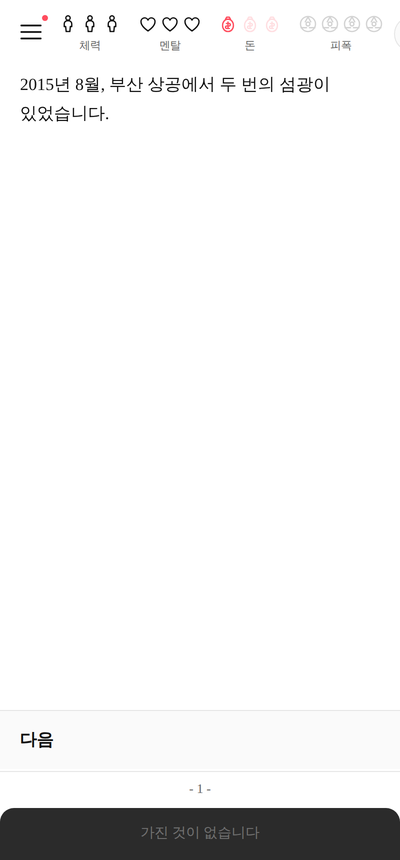
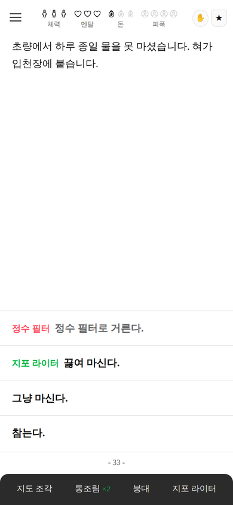
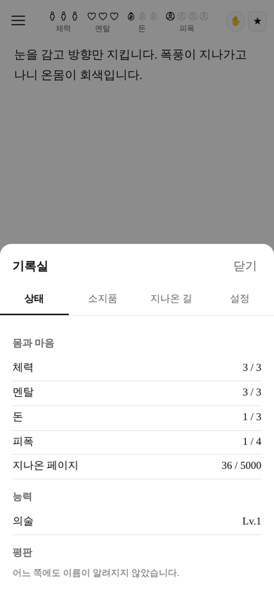

# 부산 2033

핵이 터진 부산을 배경으로 한 **텍스트 서사 선택지 게임**.
페이지를 넘기며 읽고, 선택하고, 5000페이지 끝에서 엔딩을 본다.

브라우저에서 바로 돌아가고, 그대로 **안드로이드 APK** 로도 빌드된다.

| 도입부 | 선택지 | 기록실 |
|---|---|---|
|  |  |  |

```
web/     게임 본체 (HTML + CSS + 순수 JS, 외부 의존성 0)
android/ WebView 셸과 APK 빌드 스크립트
tools/   APK 조립·서명 도구와 자동 플레이 검증기
```

## 바로 해 보기

```bash
# 브라우저
xdg-open web/index.html      # 또는 그냥 파일을 브라우저로 열기

# 5000페이지 자동 플레이 + 중복 검사
node tools/simulate.mjs 3

# APK 빌드 (Android Studio / SDK 불필요)
bash tools/fetch-android-tools.sh
bash android/build.sh
# -> build/busan2033.apk
```

## 게임 방식

원작 격인 <서울 2033>(반지하게임즈) 의 진행 방식을 부산 배경으로 옮겨 왔다.

| 요소 | 내용 |
|---|---|
| 자원 | 체력 · 멘탈 · 돈 각 **3칸**, 부산 특화로 **피폭 4칸** 추가 |
| 가젯 | 능력(교섭·완력·사격술·기계공학·의술·은신술·거짓말·항해술·자물쇠따기·독해)과 아이템을 하나로 취급 |
| 선택지 | 필요한 가젯이 앞에 붙는다. 가지고 있으면 **초록**, 없으면 **빨강**(선택 불가) |
| 감정 | 로망·유머·두통·우울함도 소지품처럼 들고 다니고 서로 변환된다 (로망 → 진통제 ×3) |
| 진행 | 페이지 단위. 끼니(110p)와 잠자리(230p)가 주기적으로 돌아온다 |
| 사망 | 체력 0 · 멘탈 0 · 피폭 4 → 각각 다른 사망 엔딩 |
| 종장 | 5000페이지에 닿으면 종장이 열리고, 그동안 쌓은 단서에 따라 엔딩이 갈린다 |

한 칸이 통째로 깎이려면 네 번 다쳐야 한다(내부 마모 게이지). 3칸짜리 게이지가
너무 빨리 비지 않으면서도, 계속 다치면 결국 무너지도록 하기 위한 장치다.

## 서사 구조

- **도입부** — 2015년 부산 상공의 두 번의 섬광, 18년 뒤 금정산 마을, 가족의 죽음, 그리고 출발. 시작 능력을 여기서 고른다.
- **본편 10장** — 서면 조합 → 산복도로 자경단 → 영도 뱃사람 → 남포동 광신도 → 53사단 → 광안대교 → 감천 → 센텀 → 기장 → 해운대. 정해진 페이지에 도달하면 끼어든다.
- **종장** — 해운대 지하 벙커. 방송 / 복수 / 침묵 / 재판 / 불 다섯 갈래.
- **엔딩 10종** — 종장 5 + 미도달 2(떠도는 사람·정착) + 사망 3.

## 중복 서사를 막는 방법

"같은 이야기가 또 나온다"는 문제를 네 겹으로 막는다.

1. **템플릿 덱** — 사건 템플릿 64종을 비복원으로 뽑는다. 가중치로 장수를 늘리지 않기 때문에 특정 사건만 몇 배씩 나오는 일이 없고, 최근 10개는 후보에서 아예 빠진다.
2. **슬롯 조합** — 구역 20 · 장소 52 · 인물 이름 1,200 · 유형 16 · 특징 24 · 위협 16 · 아이템 62 을 각각 별도의 덱에서 뽑아 끼운다.
3. **조합 서명 검사** — (템플릿·변형·구역·장소·인물·물건) 조합이 이미 나왔으면 버리고 다시 뽑는다.
4. **본문 해시 검사** — 완성된 페이지의 해시를 전부 기억한다. 겹치면 앞뒤 조각(도입 48 · 감각 30 · 전환 24 · 여운 20)을 바꿔 가며 다시 만든다.

만들어질 수 있는 이야기 조합은 **약 1억 5,880만 가지**(게임 내 설정 화면에서 확인 가능).

검증은 자동 플레이로 한다. `tools/simulate.mjs` 는 5000페이지를 끝까지 플레이하면서
**모든 페이지의 본문**을 해시로 비교한다. 한 번이라도 겹치면 실패로 끝난다.

```
$ node tools/simulate.mjs 5 1300
이야기 조합 수(대략): 158,805,060 가지
템플릿 64 · 도입 변형 192 · 선택지 233

시드 1300 · 5015p · 10장까지 · 인카운터 1902 · 고유 본문 4940 · 중복 0 · 엔딩 침묵
시드 2277 · 5016p · 10장까지 · 인카운터 1915 · 고유 본문 4941 · 중복 0 · 엔딩 재판
시드 3254 · 5015p · 10장까지 · 인카운터 1890 · 고유 본문 4940 · 중복 0 · 엔딩 복수
시드 4231 · 5015p · 10장까지 · 인카운터 1888 · 고유 본문 4940 · 중복 0 · 엔딩 방송
시드 5208 · 5015p · 10장까지 · 인카운터 1885 · 고유 본문 4940 · 중복 0 · 엔딩 침묵

통과 5/5 — 중복 본문 없음
```

(끼니·잠자리 같은 시스템 문구는 원작처럼 의도적으로 반복되며 검사에서 제외한다.)

## APK 빌드가 특이한 이유

이 저장소는 **Android Studio 도, Gradle 도, Android SDK 도 쓰지 않는다.**
`dl.google.com` 이 막힌 환경에서도 APK 를 만들 수 있도록 도구를 이렇게 모았다.

| 도구 | 출처 | 역할 |
|---|---|---|
| aapt2 | npm `aaptjs3` 에 들어 있는 리눅스 바이너리 | 리소스 컴파일 · 매니페스트 링크 |
| dx | Maven Central `com.google.android.tools:dx` | class → dex |
| apksig | Maven Central `com.android.tools.build:apksig` | v2 서명 |
| android.jar | Maven Central `org.robolectric:android-all` | 컴파일용 프레임워크 |

`tools/assemble_apk.py` 가 APK 를 조립하고, `tools/zipalign.py` 가 순수 파이썬으로
4바이트 정렬을 하고, `tools/ApkSignTool.java` 가 서명한다.
빌드 끝에 `ApkVerifyTool` 과 `tools/verify_apk.py` 가 서명·정렬·에셋을 확인한다.

- `minSdkVersion 24` (안드로이드 7.0+) — v1 서명 없이 v2 만 쓰기 때문
- `targetSdkVersion 34`
- 인터넷 권한 없음. 모든 것이 기기 안에서 돈다.

## 저장

진행 상황은 `localStorage` 에 자동 저장된다. 앱을 껐다 켜면 그 페이지에서 이어진다.
메뉴 → 설정 → "처음부터 다시 시작" 으로 초기화한다.

## 내려받기

바로 설치해 볼 수 있는 빌드본: [`dist/busan2033.apk`](dist/busan2033.apk)

안드로이드에서 "출처를 알 수 없는 앱 설치"를 허용한 뒤 파일을 열면 설치된다.
